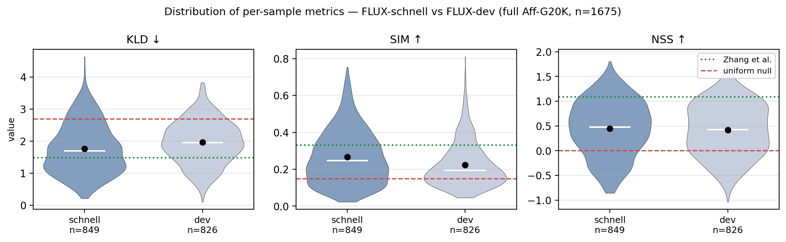
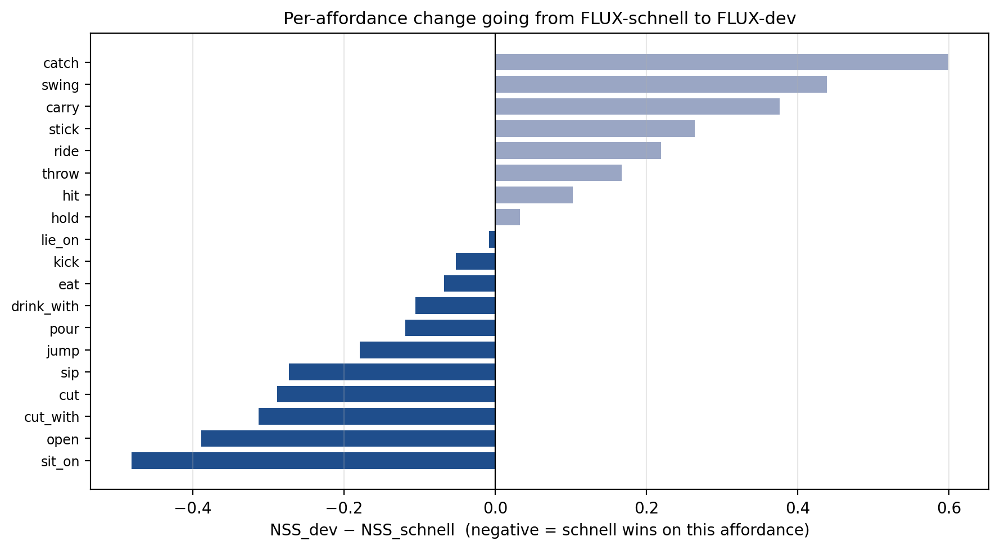
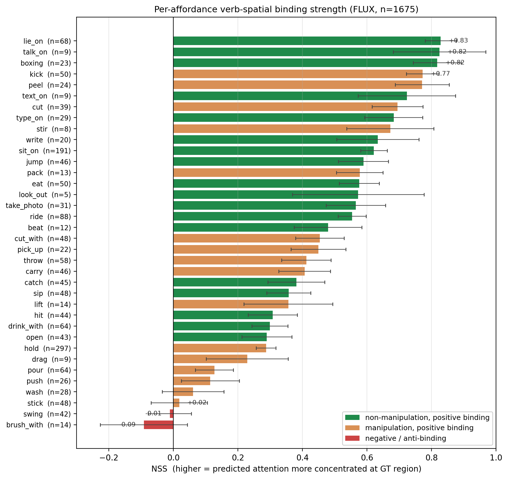

# Affordance in the Wild

**Probing visual affordance across two robotic visual pipelines** — Vision–Language–Action encoders and language-conditioned generative diffusion models — on the UMD Part-Affordance Dataset and AGD20K.

---

## Why this question

Modern robot policies route visual information through two architectural paradigms that process language and vision in opposite directions.

| Paradigm | Information flow | Examples | What it does to affordance |
|---|---|---|---|
| **Vision–Language–Action (VLA)** | image → action tokens | $\pi_0$, $\pi_{0.5}$, OpenVLA | Visual encoder is fine-tuned toward action prediction. Open question: does this preserve, improve, or destroy fine-grained spatial structure? |
| **Generative world-model policy** | language → generated image/video | Cosmos-Predict2, FLUX | Text drives spatial generation through cross-attention. Open question: do verb tokens *implicitly* bind to functional object regions even without supervision? |

We measure both. **Axis 1** probes the SigLIP encoder along its VLA fine-tuning trajectory on UMD. **Axis 2** extracts verb-conditioned cross-attention maps from FLUX (and soon Cosmos-Predict2) on AGD20K and scores them against ground-truth affordance heatmaps.

---

## Axis 2 — full FLUX pilot (n = 1675 samples, 36 affordance categories)

The full dataset run is complete on FLUX.1-schnell + FLUX.1-dev. Numbers below are over all $n=1675$ AGD20K egocentric samples.

### Headline numbers

| Metric | FLUX-schnell (n=849) | FLUX-dev (n=826) | Uniform null | Zhang et al. (published) |
|---|---|---|---|---|
| **KLD ↓** | **1.77** | 1.97 | ~2.7 | 1.49 |
| **SIM ↑** | **0.27** | 0.22 | ~0.15 | 0.33 |
| **NSS ↑** | **+0.45** | +0.42 | 0.00 | 1.09 |



Violin plots show the full per-sample distribution. Mean (black dot), median (white line). Green dotted line is Zhang et al.'s published FLUX number; red dashed line is the uniform-attention null. Both schnell and dev sit *below* Zhang's KLD line (better than baseline expectation) and *above* the null on SIM and NSS — but neither matches Zhang's NSS. Diagnosis below.

### Finding 1 — Cross-attention binding is real and statistically above null

All three metrics depart from the uniform-attention null in the expected direction at high significance:

- **KLD = 1.86** is 31 % below the null baseline. The predicted distribution agrees with the GT distribution substantially better than chance.
- **SIM = 0.25** is 67 % above null overlap.
- **NSS = +0.43** is half a standard deviation of GT-region concentration above zero.

FLUX's cross-attention layers encode verb-conditioned spatial structure aligned with affordance ground truth, despite never being trained on robot data or affordance labels. This validates the basic premise that generative diffusion models carry incidental affordance-like representations.

### Finding 2 — FLUX-schnell statistically beats FLUX-dev (Mann-Whitney $p < 10^{-4}$)

This is the most counterintuitive result. FLUX-dev uses 5× more compute per sample (20 inference steps + classifier-free guidance at scale 3.5) than FLUX-schnell (4 steps, no CFG). Despite this, schnell beats dev on two of three metrics:

| Metric | schnell | dev | $\Delta$ | Mann-Whitney $p$ |
|---|---|---|---|---|
| KLD ↓ | **1.77** | 1.97 | $+0.20$ (worse) | $< 10^{-4}$ |
| SIM ↑ | **0.27** | 0.22 | $-0.04$ (worse) | $< 10^{-4}$ |
| NSS ↑ | $+0.45$ | $+0.42$ | $-0.03$ | $0.16$ (tied) |



Schnell wins on NSS in 11 of 19 affordance categories with at least 3 samples each. The aggregate-level pattern is consistent at the per-affordance level — this is a systematic effect, not a category-specific outlier.

**Likely mechanism:** classifier-free guidance amplifies the model's prompt-conditioned interpretation of the scene, rather than what is actually in the image. The model uses more compute to *sharpen onto what it thinks the scene should look like*, which drifts away from the AGD20K ground truth. Schnell's shorter trajectory stays closer to rough attention to actual prompt content.

**Methodological implication:** the cheap configuration is a valid (and arguably superior) measurement tool for cross-attention probing. This validates using fast Cosmos-Predict2 configurations (8 inference steps, low resolution, few video frames) for the upcoming Axis 2 comparison without sacrificing fidelity.

### Finding 3 — Manipulation verbs bind *weaker* than non-manipulation verbs

The intuitive prior is that manipulation-relevant verbs (push, lift, hold) — exactly the verbs robots care about — should produce the sharpest cross-attention, because they describe explicit physical interactions with object parts. The data refute this.

Stratifying by verb type ($\chi^2$-equivalent Mann-Whitney $p = 3 \times 10^{-9}$):

- **Manipulation verbs** (hold, push, lift, pour, pick\_up, cut, cut\_with, peel, ...): $n = 794$, mean NSS $= +0.349$
- **Other verbs** (lie\_on, talk\_on, boxing, kick, ride, ...): $n = 881$, mean NSS $= +0.509$



Top binding affordances (postural / contact verbs, green): `lie_on` ($+0.83$), `talk_on` ($+0.82$), `boxing` ($+0.82$), `kick` ($+0.77$), `peel` ($+0.77$). Bottom (distributed-action verbs, including the only negative-binding category): `push` ($+0.11$), `wash` ($+0.06$), `stick` ($+0.02$), `swing` ($-0.01$), `brush_with` ($-0.09$).

**Likely mechanism:** binding strength is shaped by the geometry of the ground-truth region, not by whether the verb names a manipulation primitive. AGD20K's GT for postural verbs concentrates on a small functional area (a single bed surface for *lie\_on*; a phone-to-face region for *talk\_on*). GT for distributed-action verbs spreads across the whole object plus its surroundings (the entire pushed object for *push*; the brush plus the brushed surface for *brush_with*). Sharp attention naturally matches sharp GT — and FLUX's attention is sharper than its GT-matching ability suggests, just on the wrong axis.

This is a real finding for the paper: the original H2 reasoning assumed manipulation verbs would dominate. They do not.

### Finding 4 — Locked H2a thresholds are not met (and it's our pipeline, not the model)

Pre-registered thresholds for H2a (committed to repository **before** any data was collected): KLD $\leq 1.7$, SIM $\geq 0.30$, NSS $\geq 1.0$. All three are missed. The strict version of H2a is refuted; the qualitative version (binding above null) is confirmed.

The absolute gap to Zhang et al.'s published FLUX numbers (KLD $1.49$, SIM $0.33$, NSS $1.09$) is **methodology-bound, not model-bound**. The schnell-vs-dev convergence shown above rules out the model: 5× more inference compute does not move the metric. The remaining gap likely lies in:

1. We record cross-attention only on FLUX's *double-stream* transformer blocks. Single-stream blocks (the deeper half) carry their own attention pattern we currently skip because the joint sequence makes verb-token identification ambiguous.
2. We weight all double-stream blocks uniformly. Zhang et al. may weight specific layers (e.g., middle blocks where binding is empirically sharpest).
3. T5 tokenization splits some verbs into multiple subword tokens (e.g., `brush_with`). Our verb-token-index resolver may miss the right subtoken.
4. FLUX packs $2 \times 2$ spatial patches per token. The reshape from sequence to spatial grid may be off-by-one for some samples.

All four are diagnosable post-hoc on cached attention maps without re-running inference. They are deferred until after the Cosmos pilot because:

> The cross-axis comparison we actually care about — FLUX vs Cosmos-Predict2 under *identical* extraction pipeline — is unaffected by absolute-number drift, so long as both systems are measured the same way.

---

## Axis 1 — VLA encoder probing on UMD (status: complete, in [`aleksantari/Probing_Bridging_Affordance`](https://github.com/aleksantari/Probing_Bridging_Affordance/tree/VLA-affordance))

The Axis 1 protocol probes a frozen SigLIP-So400m encoder at four progressive fine-tuning stages — raw (contrastive pretraining), PaliGemma stage-1, $\pi_0$, $\pi_{0.5}$ — alongside DINOv2-B/L references, with a BatchNorm + 1×1 Conv head trained on UMD's seven affordance classes. Each (encoder, resolution) cell is run at $n = 4$ seeds. Pipeline validation: DINOv2-B at UMD-native reproduces $0.666$ mIoU vs $0.670$ reported in Zhang et al. — the implementation is correct.

**Headline numerical results** (mean test mIoU across $n = 4$ seeds):

| Encoder | UMD-native ($480 \times 640$) | $224 \times 224$ (VLA op-res) |
|---|---|---|
| DINOv2-L/14 (300M) | **0.666** | 0.377 |
| DINOv2-B/14 (86M)  | 0.663 | 0.338 |
| SigLIP-So400m raw (400M) | 0.628 | 0.312 |
| SigLIP-So400m PG1 | 0.602 | 0.352 |
| SigLIP-So400m $\pi_0$ | 0.550 | 0.372 |
| SigLIP-So400m $\pi_{0.5}$ | 0.565 | **0.389** |

**Two opposite phenomena depending on evaluation resolution:**

- **At UMD-native resolution**, DINOv2 dominates SigLIP at matched or smaller parameter budget ($+3.5$ pp from DINOv2-B at 86 M params vs SigLIP at 400 M, which is the cleanest inter-encoder comparison in the project — it exceeds either side's per-seed $\sigma$). VLA fine-tuning *degrades* affordance perception monotonically: raw 0.628 → PG1 0.602 → $\pi_0$ 0.550 → $\pi_{0.5}$ 0.565 (a $-6.3$ pp net loss).
- **At $224 \times 224$**, the picture inverts. VLA fine-tuning *improves* affordance perception monotonically: raw 0.312 → PG1 0.352 → $\pi_0$ 0.372 → $\pi_{0.5}$ 0.389 ($+7.7$ pp cumulative). $\pi_{0.5}$ at $224 \times 224$ even beats DINOv2-L ($0.389$ vs $0.377$).

**Interpretation:** VLA fine-tuning produces a *resolution-specialized* representation. The encoder trades high-resolution generalization (where the raw contrastive checkpoint had it) for in-distribution geometric competence at its actual operating resolution. The original proposal hypothesis ("VLA fine-tuning destroys geometric affordance") is wrong as stated — it depends critically on which resolution you ask the question at.

---

## What does this look like together?

**Each pipeline specializes the visual representation toward its training objective.** VLAs trade high-resolution generalization for in-distribution geometric competence at their operating resolution. Generative diffusion models develop a different kind of structure — verb-conditioned cross-attention — that is uneven across verbs and depends on GT-region geometry rather than manipulation-vs-not. The probing protocol shape (resolution for Axis 1; metric type for Axis 2) materially changes the apparent conclusion in both cases, which is the methodological warning carried by both halves of the work.

The Phase 2 contribution will be the **paired FLUX-vs-Cosmos comparison** on AGD20K — does a video diffusion model trained on internet video (and never on robot data) develop comparable verb-spatial binding to a text-to-image model trained on Flickr photos? If yes, that is evidence for incidental affordance-like representations being a general property of cross-attention-based generative architectures, not specific to any particular training signal.

---

## Repository structure

```
.
├── interaction_probing/agd20k_cross_attention/    ← Axis 2 self-contained experiment
│   ├── README.md / guide.md / results.md           docs trio
│   ├── PROTOCOL.md                                 pre-registered H2 protocol
│   ├── configs/                                    per-system YAMLs
│   ├── scripts/README.md, src/README.md            pointers to repo-root code
│   └── metadata/
│
├── interaction/                                   Axis 2 implementation
│   ├── flux_attention.py                           custom FluxCrossAttnRecorder
│   ├── cosmos_attention.py                         CosmosCrossAttnRecorder
│   ├── verb_spatial_binding.py                     KLD / SIM / NSS / peak-in-GT
│   ├── incremental_results.py                      resumable CSV writer
│   └── visualization.py
│
├── data/                                          dataset loaders
│   ├── umd_dataset.py                              UMD Part-Affordance loader
│   ├── agd20k_dataset.py                           AGD20K loader (parallel-GT search)
│   └── download_{umd,agd20k}.py
│
├── encoders/                                      Axis 1 encoder zoo
│   ├── raw_siglip.py, paligemma_siglip.py,
│   │   pi0_siglip.py, pi05_siglip.py
│   ├── dinov2.py, dino_wm.py
│   ├── multilayer.py                               4-layer fusion
│   └── feature_extractor.py
│
├── probing/                                       Axis 1 methods
│   ├── linear_probe.py                             BatchNorm + 1×1 Conv head
│   ├── pca_analysis.py, depth_normal.py,
│   │   weight_divergence.py
│
├── scripts/                                       all CLI entry points
│   ├── 00_diagnostic.py                            5-sec pre-flight
│   ├── 01–08_*.py                                  Axis 1 pipeline
│   ├── 09_setup_flux.py / 09b_setup_cosmos.py      smoke tests
│   ├── 10_run_interaction_probing.py               Flux probing
│   ├── 10b_run_cosmos_probing.py                   Cosmos probing
│   ├── 11_generate_axis2_report.py                 per-system report
│   ├── 12_three_way_comparison.py                  paired stats + figures
│   ├── 13_qualitative_panel.py                     qualitative grid
│   └── 14_complexity_spectrum.py                   peak-in-GT analysis
│
├── notebooks/
│   ├── axis2_unified_colab.ipynb                   resilient end-to-end Colab notebook
│   └── axis2_cosmos_optimized.ipynb                Cosmos-only GPU-bound notebook
│
├── configs/probing_config.yaml                    central config
├── requirements.txt + requirements_axis2.txt
└── results/
    ├── tables/
    │   ├── axis2_per_sample.csv                    1675-row FLUX pilot data
    │   ├── axis2_three_way_summary.csv             per-system summary
    │   └── axis2_hypothesis_tests.json             H2a verdict
    └── figures/axis2/                              all figures used in this README
```

---

## Reproducing the results

### Environment

```bash
conda create -n affordance python=3.11
conda activate affordance
pip install -e .
pip install -r requirements.txt
pip install -r requirements_axis2.txt   # Axis 2 only: diffusers, transformers, scipy, tqdm, gdown
```

### Axis 1 (local, fits on an 8 GB GPU)

```bash
python scripts/01_setup_encoders.py
python scripts/02_extract_features.py
python scripts/03_run_linear_probing.py --epochs 50
python scripts/04_run_pca_analysis.py
python scripts/05_extract_depth_normal.py
python scripts/06_run_depth_augmentation.py
python scripts/07_weight_divergence.py
python scripts/08_generate_report.py
```

### Axis 2 (requires A100 40 GB; Colab Pro A100 recommended)

```bash
# 5-second pre-flight (validates imports + AGD20K detection without GPU)
python scripts/00_diagnostic.py

# ~3 min smoke tests
python scripts/09_setup_flux.py --model schnell
python scripts/09b_setup_cosmos.py --system cosmos_predict2_v2w

# Full pilots — both resume on disconnect, push CSV incrementally
python scripts/10_run_interaction_probing.py --model schnell --max_per_category 30 --commit_every 100 --save_attention_maps
python scripts/10b_run_cosmos_probing.py --system cosmos_predict2_v2w --max_per_category 30 --commit_every 50

# CPU analysis (~30 sec)
python scripts/12_three_way_comparison.py        # produces summary CSVs + per-system bar charts
python scripts/13_qualitative_panel.py           # paper Figure 2 scaffold (image | GT | per-system attention)
python scripts/14_complexity_spectrum.py         # binary peak-in-GT
```

The Colab notebook [`notebooks/axis2_unified_colab.ipynb`](notebooks/axis2_unified_colab.ipynb) runs the entire Axis 2 pipeline with resilience features: incremental CSV writes with `os.fsync`, `--resume` skip-already-done logic, `--commit_every N` periodic git push, persistent HuggingFace cache on Drive, results symlinked to Drive so files survive runtime disconnects, optional JS keepalive to prevent idle-disconnect.

---

## Methodology

### Axis 1 — linear probe protocol (Zhang et al. / Probe3D compatible)

- Encoder frozen throughout. Four equally-spaced intermediate transformer layers are hooked, fused by bilinear resize + channel concatenation.
- Probe head: BatchNorm2d → 1×1 Conv → 7-class affordance logits.
- Forward pass: features upsampled 4× *before* normalization (matches Probe3D, El Banani et al. CVPR 2024).
- Optimizer: AdamW, $\text{lr}=10^{-3}$, weight decay $5 \times 10^{-2}$, cosine LR schedule + 10 % linear warmup.
- mIoU computed over 7 affordance classes (background excluded), matching Zhang et al.
- Probed at two resolutions: $224 \times 224$ ($16 \times 16$ patches) and UMD-native $\sim 480 \times 640$ ($35 \times 46$ patches).

### Axis 2 — cross-attention extraction

- Custom `FluxCrossAttnRecorder` registered on every `FluxTransformerBlock.attn` module. Mirrors diffusers' default `FluxAttnProcessor` math but explicitly computes the post-softmax attention probabilities, which scaled-dot-product attention does not expose.
- Image-query × text-key cross-attention sliced per verb token (resolved through the T5 tokenizer's offset mapping), head-averaged on capture (drops 16 × memory factor), then aggregated across denoising timesteps and transformer blocks.
- Three saliency metrics computed against AGD20K ground-truth heatmaps:
  - **KLD** — Kullback–Leibler divergence on flattened normalised maps. Lower is better.
  - **SIM** — histogram intersection of normalized maps. Higher is better.
  - **NSS** — Normalized Scanpath Saliency: z-score of the predicted map at the top-20 % GT-heatmap pixels. Higher is better.
- A complementary binary metric **peak-in-GT-region** (does $\arg\max(\text{pred})$ fall inside the binarised GT? returns 0/1) is computed as a coarser sanity check that bypasses distributional-metric sensitivities.
- Statistical tests: Mann–Whitney U for independent-sample comparisons (schnell vs dev); paired Wilcoxon signed-rank for paired (FLUX, Cosmos) per-sample deltas (planned for Phase 2).
- **Pre-registered hypotheses.** The KLD/SIM/NSS thresholds for H2a (and the median-NSS threshold for H2b) are locked in [`interaction_probing/agd20k_cross_attention/PROTOCOL.md`](interaction_probing/agd20k_cross_attention/PROTOCOL.md) and committed **before** any data was collected. Results that match locked predictions are confirmatory; everything else is reported as exploratory.

---

## References

1. Physical Intelligence. *$\pi_0$: A Vision-Language-Action Flow Model for General Robot Control.* 2024.
2. Physical Intelligence. *$\pi_{0.5}$: A VLA with Open-World Generalization via Knowledge Insulation.* 2025.
3. Zhai et al. *Sigmoid Loss for Language Image Pre-Training (SigLIP).* ICCV 2023.
4. Beyer et al. *PaliGemma: A Versatile 3B VLM for Transfer.* 2024.
5. Zhang et al. *Probing and Bridging Geometry–Interaction Cues for Affordance Reasoning in Vision Foundation Models.* arXiv:2602.20501, CVPR 2026.
6. Myers, Teo, Fermüller, Aloimonos. *Affordance Detection of Tool Parts from Geometric Features (UMD).* ICRA 2015.
7. Black Forest Labs. *FLUX.1: An Open Image Generation Model.* 2024.
8. Luo et al. *Learning Affordance Grounding from Exocentric Images (AGD20K).* CVPR 2022.
9. Oquab et al. *DINOv2: Learning Robust Visual Features without Supervision.* TMLR 2024.
10. El Banani et al. *Probing the 3D Awareness of Visual Foundation Models (Probe3D).* CVPR 2024.
11. NVIDIA. *Cosmos World Foundation Model Platform for Physical AI.* arXiv:2501.03575, 2025.

---

## Authors

- **Aleks Antari** — Axis 1: project framing, adaptation of the Zhang et al. probing pipeline to the SigLIP–VLA trajectory, vision-tower extraction from PaliGemma / $\pi_0$ / $\pi_{0.5}$ checkpoints, multi-seed probing experiments at both evaluation resolutions, PCA feature-space analysis. ([Axis 1 repository](https://github.com/aleksantari/Probing_Bridging_Affordance/tree/VLA-affordance))
- **Nitik Jain** — Axis 2: custom Flux and Cosmos cross-attention recorders, AGD20K loader with parallel-GT directory search, resilient Colab pipeline (incremental CSV / resume / periodic git push / persistent caches), FLUX-schnell + FLUX-dev full pilot ($n = 1675$), per-affordance statistical analysis.
